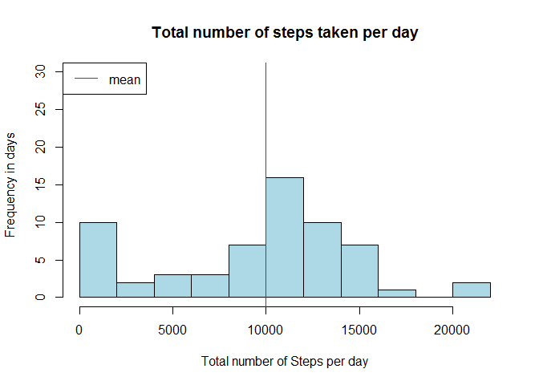
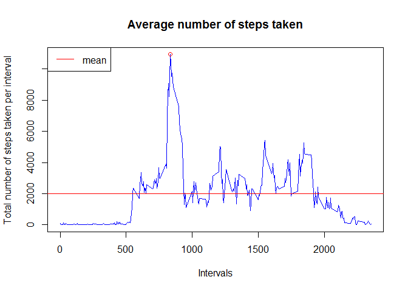
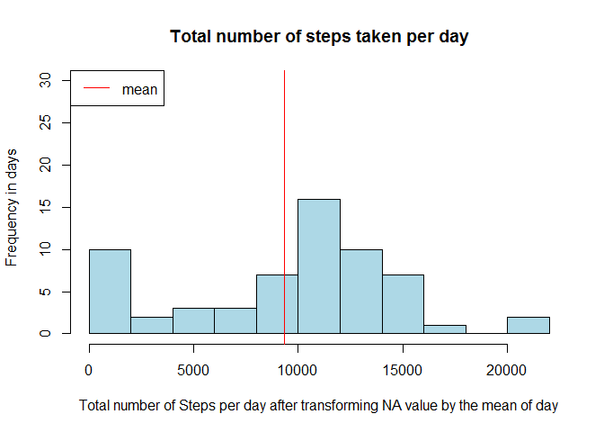
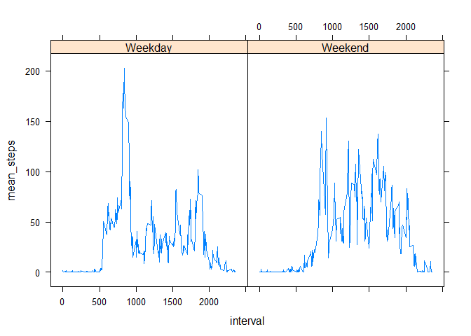

# Coursera, Reproductible Research, Assignment: Course Project 1
Gauthier le Courtois du Manoir  
10 avril 2016  


This is a work for Coursera "Reproducible Research" course, Week 1  

## Download & preprocessing the data

```r
library(xtable)
```

```
## Warning: package 'xtable' was built under R version 3.2.4
```

```r
library(dplyr)
```

```
## Warning: package 'dplyr' was built under R version 3.2.3
```

```
## 
## Attaching package: 'dplyr'
```

```
## The following objects are masked from 'package:stats':
## 
##     filter, lag
```

```
## The following objects are masked from 'package:base':
## 
##     intersect, setdiff, setequal, union
```

```r
library(lattice)
setwd("C:/Users/Gauthier/Documents/R Working Directory/Reproducible Research/")
if(!file.exists("./data")){dir.create("./data/")}
url<-"https://d396qusza40orc.cloudfront.net/repdata%2Fdata%2Factivity.zip"
sourcefile<-"https://d396qusza40orc.cloudfront.net/repdata%2Fdata%2Factivity.zip"
destfile<-"./data/activity.zip"
csvfile<-"./data/activity.csv"
download.file(sourcefile, destfile)
unzip(destfile,exdir = "data")
activity<-read.csv(file = csvfile, na.strings = "NA" )
head(activity)
```

```
##   steps       date interval
## 1    NA 2012-10-01        0
## 2    NA 2012-10-01        5
## 3    NA 2012-10-01       10
## 4    NA 2012-10-01       15
## 5    NA 2012-10-01       20
## 6    NA 2012-10-01       25
```
##Mean total number of steps taken per day

```r
sum<-data.frame(tapply(activity$steps, activity$date, sum, na.rm=TRUE))
Totstepperday<-cbind(rownames(sum),sum)
rownames(Totstepperday)=c(1:length(unique(activity$date)))
colnames(Totstepperday)=c("Date","Tot_num_step")
mean_all_days<-rep(mean(Totstepperday$Tot_num_step),length(unique(activity$date)))
names(mean_all_days)=c("Mean")
Totstepperday<-cbind(Totstepperday,mean_all_days)

#head(Totstepperday)

hist(Totstepperday$Tot_num_step,xlab="Total number of Steps per day",ylab="Frequency in days",ylim=c(0,30),main="Total number of steps taken per day",col="lightblue", breaks=10)
summary(Totstepperday$Tot_num_step)
```

```
##    Min. 1st Qu.  Median    Mean 3rd Qu.    Max. 
##       0    6778   10400    9354   12810   21190
```

```r
abline(v=10000,col="red")
legend("topleft", legend ="mean",lty=1, col="red")
```


  
For the total number of step per day, the mean is **9354.2295082** and the median is **10395**
  

## Average daily activity pattern

```r
tmp<-data.frame(tapply(activity$steps, activity$interval, sum, na.rm=TRUE))
Totstepperintervals<-cbind(as.integer(rownames(tmp)),tmp)
colnames(Totstepperintervals)=c("Interval","Tot_num_step")
rownames(Totstepperintervals)=c(1:length(unique(Totstepperintervals$Interval)))

plot(Totstepperintervals$Interval,Totstepperintervals$Tot_num_step, type="l",col="blue",xlab="Intervals",ylab="Total number of steps taken per interval",main="Average number of steps taken")

abline(h=mean(Totstepperintervals$Tot_num_step, na.rm=T),type="l",col="red")
```

```
## Warning in int_abline(a = a, b = b, h = h, v = v, untf = untf, ...):
## paramètre graphique "type" incorrect
```

```r
points(subset(Totstepperintervals,Tot_num_step==max(Totstepperintervals$Tot_num_step,na.rm=T))$Interval,max(Totstepperintervals$Tot_num_step,na.rm=T),col="red")
legend("topleft", legend ="mean",lty=1, col="red")
```


  
The interval **835** has the maximum number of step which is **10927**.
  
## Imputing missing values
Number of missing values in the activity dataset is **2304**.

We replace the NA value for each day by the mean value for the day.


```r
#We replace NA value by the mean of steps per day
mean_by_day<-data.frame(tapply(activity$steps, activity$date, mean, na.rm=TRUE))
na_mean<-activity
na_mean$date<-as.character(na_mean$date)
#Date which have NA as value of steps
a<-0
for (i in 1:nrow(na_mean)){
  if(is.na(na_mean$steps[i])){
      if(is.na(mean_by_day[na_mean$date[i],])==TRUE){
          na_mean$steps[i]<-0
      }else{
          na_mean$steps[i]<-mean_by_day[na_mean$date[i],]
      }
    a<-sum(a,mean_by_day[na_mean$date[i],], na.rm=T)
    #print(mean_by_day[na_mean$date[i],])
   # na_mean$steps[i]<-mean_by_day[na_mean$date[i],]
  }
}
```
  
All the missing value are for all the day. So mean, median and sum of steps haven't changed.There is no impact with using mean of median to replace NA value.


```r
#Create a dataset to have the total number of step per day with this new dataset
sum_na_mean<-data.frame(tapply(na_mean$steps, na_mean$date, sum, na.rm=TRUE))
Totstepperday_na_mean<-cbind(rownames(sum_na_mean),sum_na_mean)
rownames(Totstepperday_na_mean)=c(1:length(unique(activity$date)))
colnames(Totstepperday_na_mean)=c("Date","Tot_num_step")
mean_all_days_na_mean<-rep(mean(Totstepperday_na_mean$Tot_num_step),length(unique(activity$date)))
names(mean_all_days_na_mean)=c("Mean")
Totstepperday_na_mean<-cbind(Totstepperday_na_mean,mean_all_days_na_mean)

#creating the plot
hist(Totstepperday_na_mean$Tot_num_step,xlab="Total number of Steps per day after transforming NA value by the mean of day",ylab="Frequency in days",ylim=c(0,30),main="Total number of steps taken per day",col="lightblue", breaks=10)
#summary(Totstepperday_na_mean$Tot_num_step_na_mean)
abline(v=mean(Totstepperday_na_mean$Tot_num_step),col="red")
legend("topleft", legend ="mean",lty=1, col="red")
```


  
For the total number of step per day, after replacing NA value by the mean of step of the day, the mean is **9354.2295082** and the median is **1.0395\times 10^{4}**
  
As said before, there is no impact in replacing NA value by the mean of step of the day.

##Are there differences in activity patterns between weekdays and weekends? :


```r
#We create a set of data with weekday/weekend factor variable
Sys.setlocale("LC_TIME", "English") # to have weekday in english
```

```
## [1] "English_United States.1252"
```

```r
na_mean2<-cbind(na_mean,as.character(weekdays(as.Date(na_mean$date))))
```

```
## Warning in strptime(xx, f <- "%Y-%m-%d", tz = "GMT"): unable to identify current timezone 'M':
## please set environment variable 'TZ'
```

```
## Warning in strptime(xx, f <- "%Y-%m-%d", tz = "GMT"): unknown timezone
## 'localtime'
```

```r
names(na_mean2)<-c("steps","date","interval","day")

for (i in 1:nrow(na_mean2)){
  if(na_mean2$day[i]=="Monday" | na_mean2$day[i]=="Tuesday" | na_mean2$day[i]=="Wednesday" | na_mean2$day[i]=="Thursday" | na_mean2$day[i]=="Friday"){
    na_mean2$typeday[i]<-"Weekday"
  }else {
        if(na_mean2$day[i]=="Saturday" | na_mean2$day[i]=="Sunday"){ 
            na_mean2$typeday[i]<-"Weekend"
        }
  }
}
na_mean2$typeday<-factor(na_mean2$typeday)

#We plot the data
plot_na_mean <- na_mean2 %>% 
        select(steps, interval, typeday) %>%
        group_by(typeday,interval ) %>%
        summarise(mean(steps)) 
  names(plot_na_mean)<-c("typeday","interval","mean_steps")

  xyplot(mean_steps~interval| typeday, type="l",data=plot_na_mean)  
```


  
As we can see on the plots,   
- During Weekday, the average number of steps begins ealier than in Weekend and ends also earlier then in Weekend  
- The average of steps is higher in Weekend than in Weekday  
- There is a pic of activity in Weekday between interval 500 and 100  
